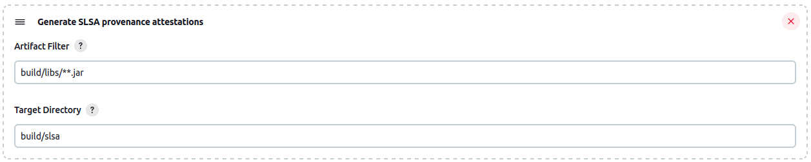

[](https://github.com/netomi/slsa-jenkins-plugin/actions)
[](LICENSE)

# SLSA Jenkins Plugin

The SLSA Jenkins plugin generates [SLSA provenance attestations](https://slsa.dev/provenance/) for artifacts
generated during a build.

## Job configuration

The plugin provides a ```Post-build action``` which will generate provenance attestations
(`<artifact-name>.intoto.jsonl` | `multiple.intoto.jsonl`) in SLSA format for configured artifacts
after a successful build.



**Artifact Filter**: Specifies the artifacts to include.

**Target Directory**: Specifies the directory to which the generated provenance attestion should be stored.

## LICENSE

Licensed under MIT, see [LICENSE](LICENSE)

